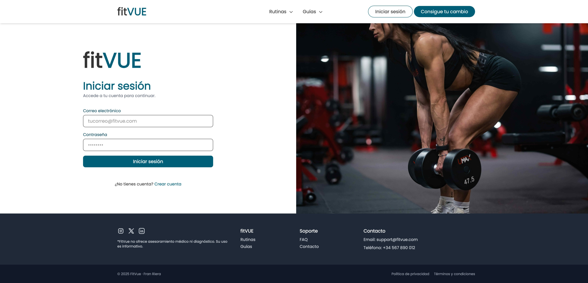
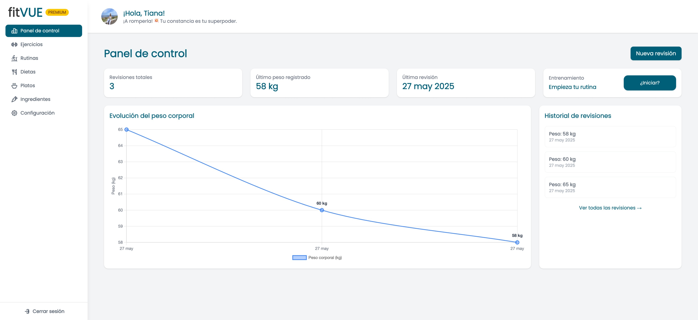
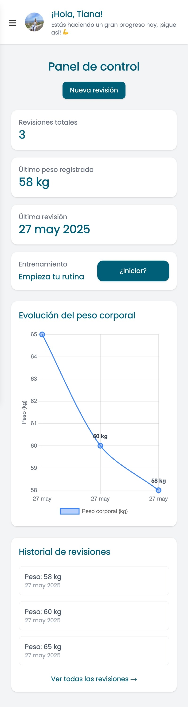
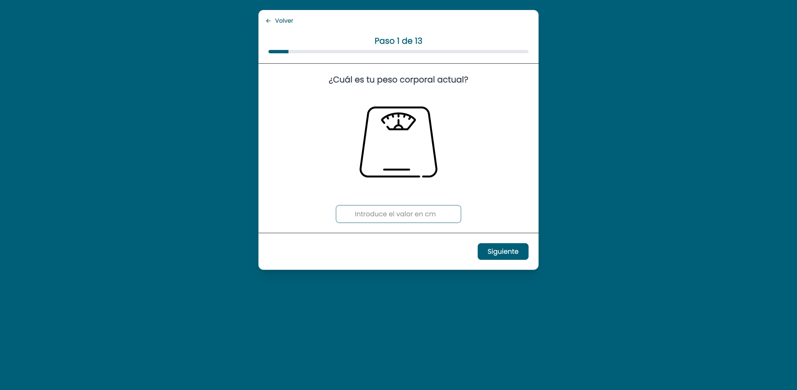
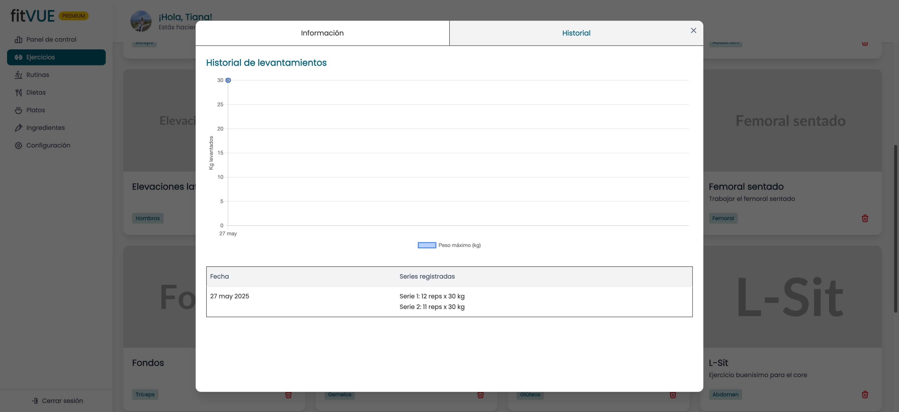
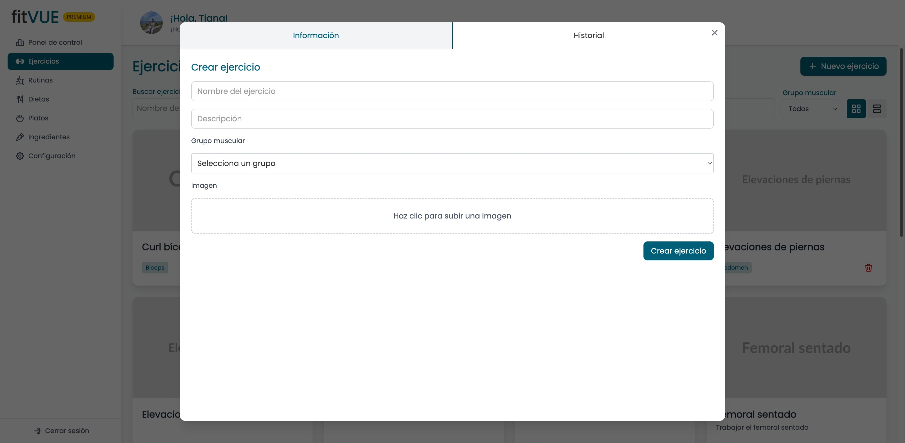
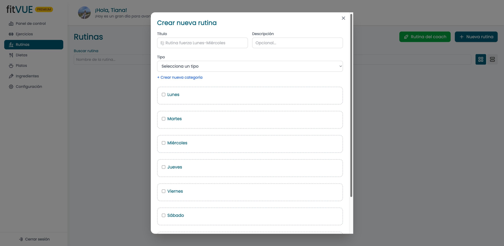
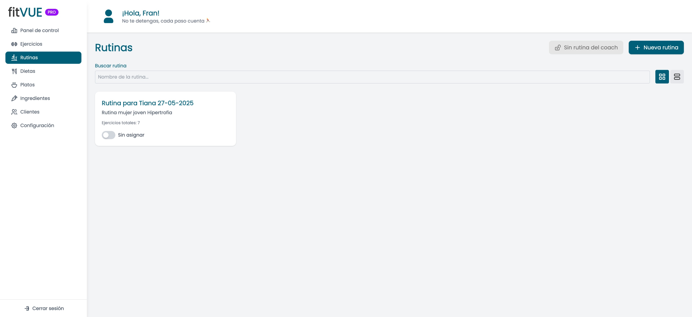

# FitVue 🏋️‍♂️  

🚀 **FitVue** es una plataforma interactiva para personas interesadas en el fitness y la vida saludable. Ofrece recomendaciones personalizadas, seguimiento del progreso y herramientas de gestión potentes para profesionales del entrenamiento.  

Diseñada para usuarios individuales y entrenadores personales, **FitVue** centraliza el control del progreso, la planificación de rutinas, las revisiones físicas y mucho más.  

---

## 👥 Roles y planes disponibles

### 👤 Usuario Básico (gratuito)
- Acceso limitado al contenido.
- Visualización de rutinas y dietas predefinidas.
- Sin personalización ni seguimiento detallado.

### 💎 Usuario Premium
- Registro y seguimiento de revisiones físicas.
- Generación automática de rutinas y dietas personalizadas.
- Visualización de gráficos de evolución, radar charts y más.

### 🧑‍🏫 Usuario Profesional (Pro)
- Gestión completa de clientes.
- Asignación de rutinas y dietas a medida.
- Seguimiento del progreso de cada cliente en tiempo real.
- Paneles de control administrativos potentes.

---

## 🎯 Objetivos del proyecto

- ✅ Desarrollar una página web dinámica, intuitiva y funcional.
- ✅ Permitir a los usuarios registrarse y recibir recomendaciones personalizadas.
- ✅ Ofrecer planes de ejercicio y alimentación adaptados al perfil y rol del usuario.
- ✅ Facilitar el seguimiento del progreso mediante visualizaciones intuitivas.
- ✅ Proporcionar herramientas completas a profesionales para gestionar clientes.

---

## 🛠️ Tecnologías utilizadas

- **Frontend:** VueJS ⚡  
- **Backend y BBDD:** Supabase 🔥  
- **Autenticación:** Supabase Auth 🔐  
- **Estilos:** TailwindCSS 🎨  
- **Gestión de estado:** Pinia 🌐  

---

## 🖼️ Vista previa de la plataforma

### 🧭 Landing y Login
| Landing | Login |
|--------|-------|
|  |  |

---

### 🏠 Panel principal
| Web | Móvil |
|-----|-------|
|  |  |

---

### 📊 Seguimiento del progreso

| Revisión física | Nueva revisión |
|----------------|----------------|
|  |  |

---

### 💪 Ejercicios y levantamientos

| Historial de levantamientos | Crear ejercicio |
|-----------------------------|------------------|
|  |  |

---

### 🥗 Planificación personalizada

| Crear dieta personalizada |
|---------------------------|
|  |

---

### 👥 Gestión por el profesional

| Panel de clientes | Panel de rutinas |
|-------------------|------------------|
|  |  |

---

## ✨ Características principales

### 👤 Gestión de usuario
- Registro e inicio de sesión con autenticación segura.
- Edición del perfil con información personal y objetivos.

### 🏋️ Planes personalizados
- Rutinas y dietas generadas automáticamente según objetivos.
- Seguimiento del progreso a través de gráficos y comparativas.

### 📈 Progreso visual e histórico
- Revisión física con medidas detalladas.
- Radar charts y line charts para visualizar la evolución.

### 📋 Panel Pro para entrenadores
- Gestión completa de clientes.
- Asignación de rutinas, dietas y revisiones personalizadas.
- Visualización clara del progreso de cada cliente.

---

## 🚧 En desarrollo

- 📅 Calendario de sesiones integradas  
- 📲 Versión móvil como Progressive Web App (PWA)  

---

## 💬 Contribuciones

Toda sugerencia, mejora o pull request es más que bienvenida 🙌

---

## 🌍 Demo

🔗 [https://fitvue.netlify.app/](https://fitvue.netlify.app/)

---